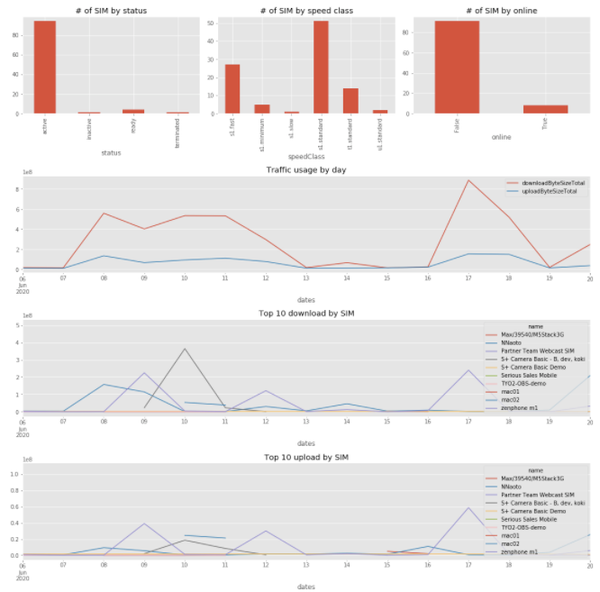

# Soracom notebooks

A collection of notebooks to manage Soracom operator, those can be run on something like Jupyter Notebook.

## How to use

### Docker

```bash
docker run --rm -v "$PWD":/home/jovyan/work -p 8888:8888 -e ACCESS_KEY_ID=${YOUR_SORACOM_ACCESS_KEY_ID} -e ACCESS_KEY=${YOUR_SORACOM_ACCESS_KEY} jupyter/pyspark-notebook
```

Then, url for notebook will be shown on your console.

## Notebooks provided

- **SORACOM-Operator-Essential-Dashboard**: 
  - Essential dashboard for Soracom Operator, 
  
  - It shows
    - \# of SIMs by status
    - \# of SIMs by spped class
    - \# of SIMs by online status
    - Daily upload/download traffic
    - Daily Top10 upload/download SIM
